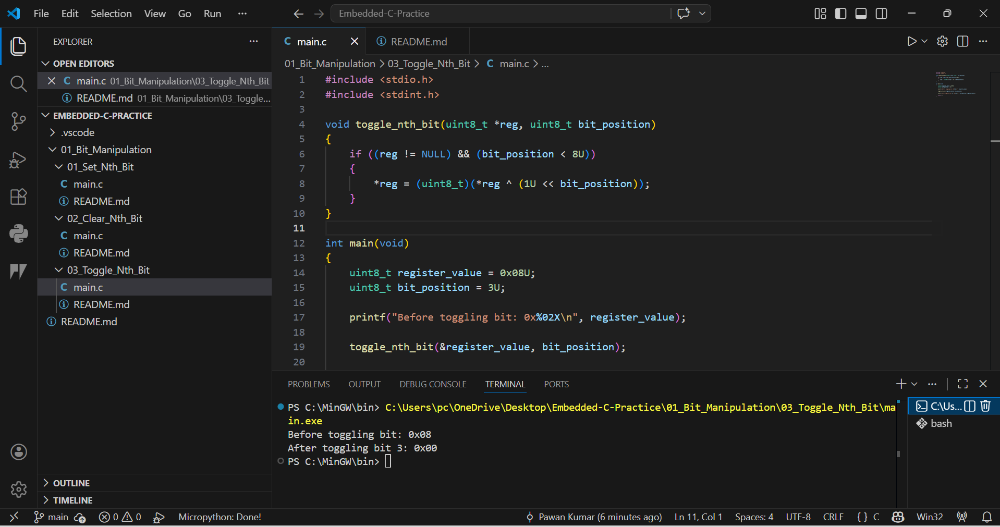

# 03 - Toggle Nth Bit in Register

## Objective
Toggle any selected bit in an 8-bit register using XOR operation.

## Formula Used
reg = reg ^ (1 << n)

## Explanation
XOR operation flips only the selected target bit.
1 becomes 0 and 0 becomes 1.

## Example
Initial Register : 0x08  
Bit Position     : 3  
Final Register   : 0x00

## Industrial Use
- LED blinking
- Output inversion
- Relay pulse generation
- Control line toggling

## Output
Before toggling bit: 0x08
After toggling bit 3: 0x00
