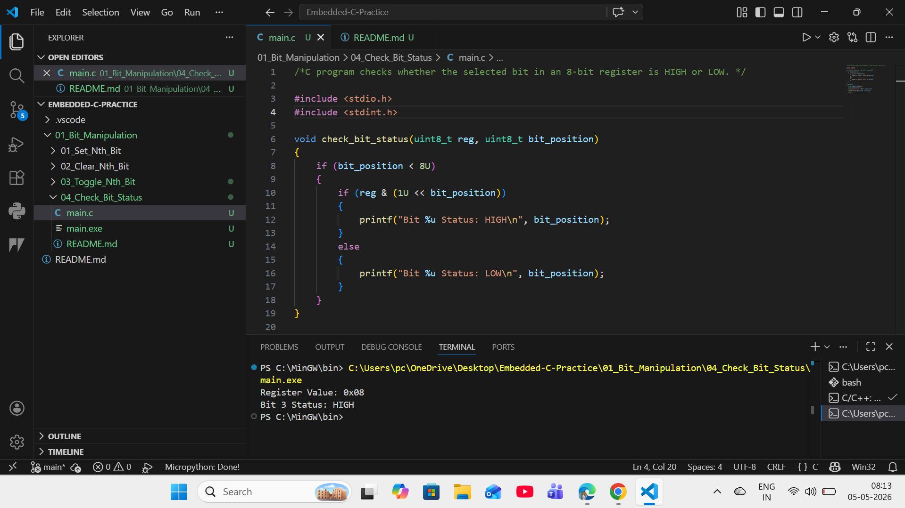

# 04 - Check Bit Status High or Low

## Objective
Check whether a selected bit in an 8-bit register is HIGH or LOW.

## Formula Used
reg & (1 << n)

## Explanation
A bit mask is created by left shifting binary 1.
AND operation checks whether the selected bit is active.

## Example
Register Value  : 0x08  
Bit Position    : 3  
Status          : HIGH

## Industrial Use
- GPIO input checking
- Fault flag polling
- Interrupt flag monitoring
- Sensor status validation

## Output
Register Value: 0x08
Bit 3 Status: HIGH
