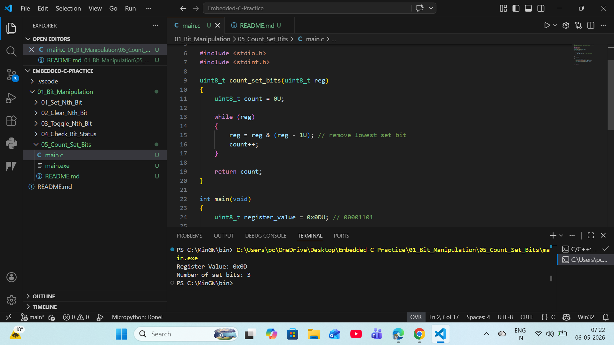

# 05 - Count Set Bits in Register

## Objective
Count number of bits set to 1 in an 8-bit register.

## Algorithm Used
Brian Kernighan Algorithm

## Formula
n = n & (n - 1)

## Explanation
Each iteration removes the rightmost set bit.
Number of iterations = number of set bits.

## Example
Register Value : 0x0D (00001101)  
Set Bits       : 3

## Industrial Use
- Parity checking
- Error detection
- Communication protocols
- Data validation

## Output Screenshot

