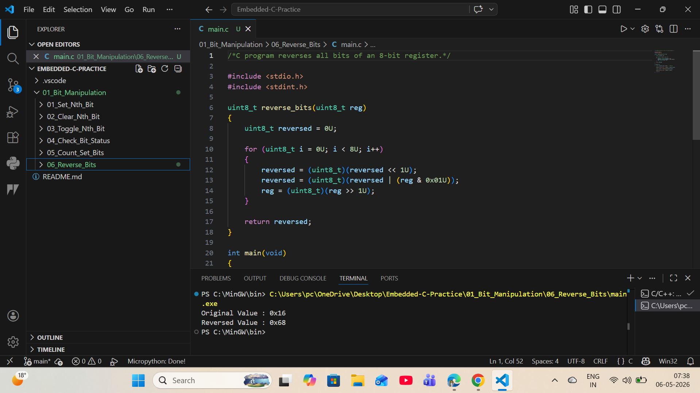

# 06 - Reverse Bits in Byte

## Objective
Reverse all bits of an 8-bit register.

## Logic
The least significant bit is extracted and shifted into the reversed byte one by one.

## Example
Input  : 0x16 = 00010110  
Output : 0x68 = 01101000

## Industrial Use
- Serial communication bit-order conversion
- Protocol data formatting
- Display driver data arrangement
- Sensor packet processing

## Output
Original Value : 0x16  
Reversed Value : 0x68

