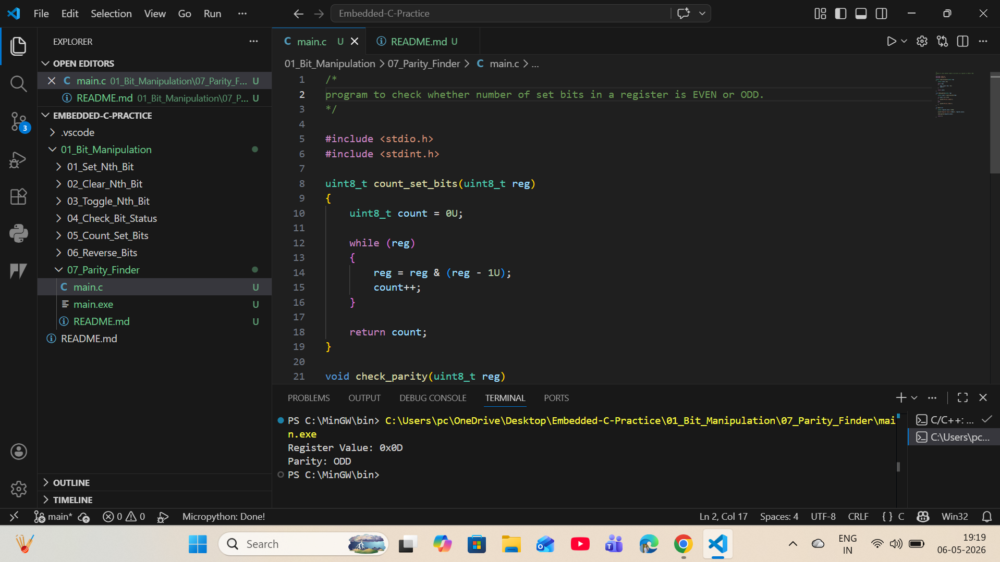

# 07 - Parity Check Odd or Even

## Objective
Determine whether number of set bits is even or odd.

## Logic
Count total set bits.
If divisible by 2 → EVEN  
Else → ODD

## Example
Register Value : 0x0D (00001101)  
Set Bits       : 3  
Parity         : ODD

## Industrial Use
- UART communication parity bit
- Error detection in data transfer
- Communication protocols

## Output
Register Value: 0x0D  
Parity: ODD
