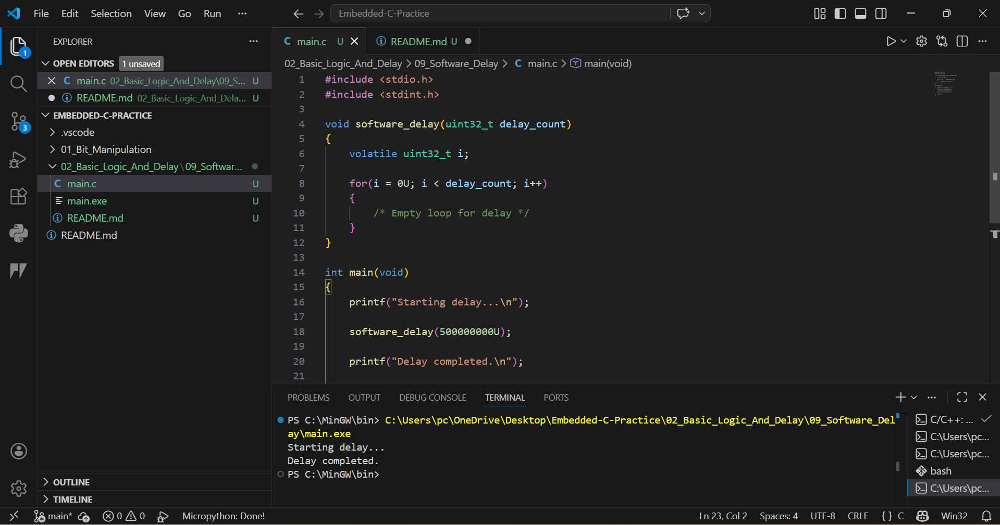

# 09 - Software Delay Loop

## Objective
Generate delay using software loop execution.

## Concept
CPU repeatedly executes empty instructions to waste clock cycles intentionally.

## Why Volatile?
The loop counter is declared volatile to prevent compiler optimization.

## Example
The program creates a visible delay between two print statements.

## Industrial Use
- LED blinking
- Relay hold timing
- Buzzer timing
- Basic firmware sequencing

## Limitation
Software delay is CPU dependent and not accurate for real-time systems.

## Output
Starting delay...
Delay completed.
