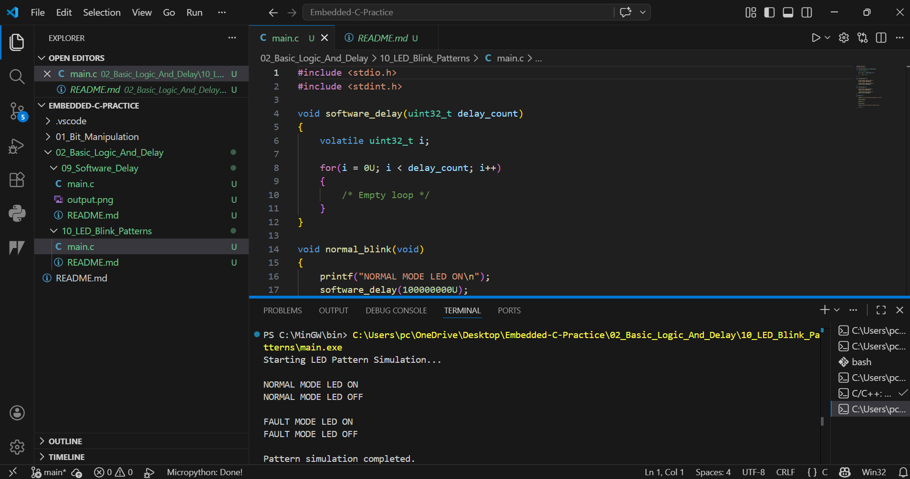

# 10 - LED Blink Pattern Generator

## Objective
Generate different LED blinking patterns using software delay logic.

## Concept
Different delay values create different blink rates.

## Patterns Implemented
- Normal blink
- Fast blink (fault indication)

## Industrial Use
- System heartbeat indication
- Alarm indication
- Fault status indication
- Industrial control panels

## Limitation
Software delay blocks CPU execution and is not precise.

## Output
Starting LED Pattern Simulation...

NORMAL MODE LED ON
NORMAL MODE LED OFF

FAULT MODE LED ON
FAULT MODE LED OFF

Pattern simulation completed.
