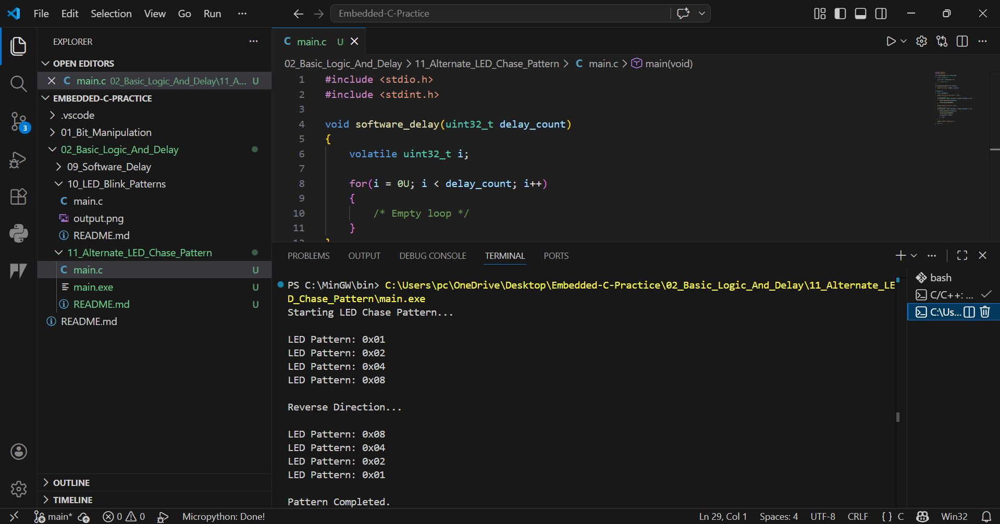

# 11 - Alternate LED Chase Pattern

## Objective
Generate LED chase pattern using bit shifting logic.

## Concept
Bit shifting moves active LED position from left to right and reverse.

## Example Pattern
0x01 → 0x02 → 0x04 → 0x08

Then reverse:
0x08 → 0x04 → 0x02 → 0x01

## Industrial Use
- Startup sequence indication
- Panel diagnostics
- Running status indicators
- Animation effects

## Output
Starting LED Chase Pattern...

LED Pattern: 0x01
LED Pattern: 0x02
LED Pattern: 0x04
LED Pattern: 0x08

Reverse Direction...

LED Pattern: 0x08
LED Pattern: 0x04
LED Pattern: 0x02
LED Pattern: 0x01

Pattern Completed.
