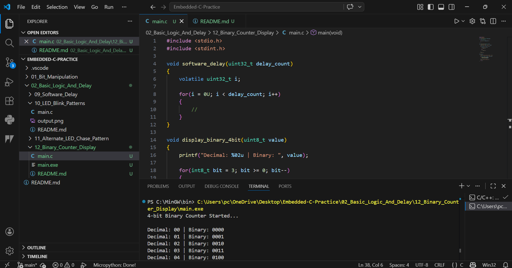

# 12 - Binary Counter Display Logic

## Objective
Simulate a 4-bit binary counter using Embedded C.

## Concept
A counter value is displayed in binary format from 0000 to 1111.

## Example
Decimal 0  → 0000  
Decimal 1  → 0001  
Decimal 2  → 0010  
Decimal 15 → 1111

## Industrial Use
- GPIO output testing
- Digital counter systems
- Status indication
- Display logic development

## Output
4-bit Binary Counter Started...

Decimal: 00 | Binary: 0000  
Decimal: 01 | Binary: 0001  
Decimal: 02 | Binary: 0010  
...
Decimal: 15 | Binary: 1111

Counter Completed.
