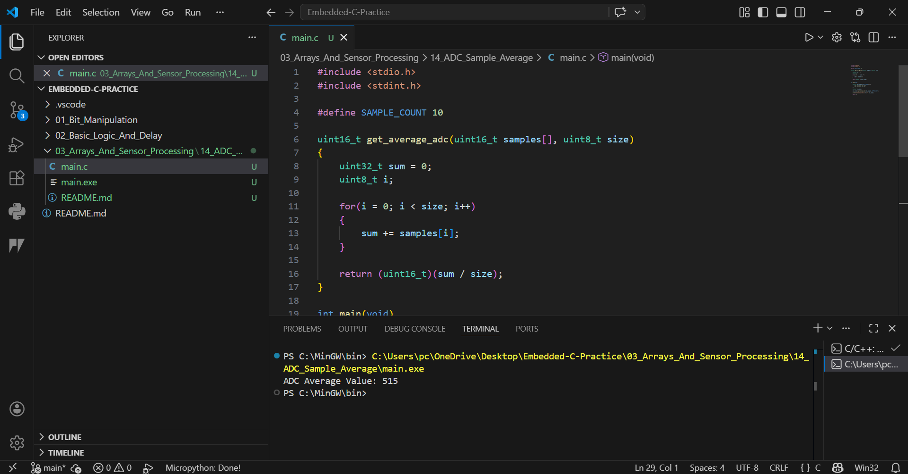

# 14 - ADC Sample Average

## Objective
Calculate average value from 10 ADC samples.

## Concept
Real sensor readings are not always stable. Taking multiple ADC samples and averaging them reduces small noise variation.

## Example Samples
512, 518, 515, 510, 520, 516, 514, 519, 513, 517

## Output
ADC Average Value: 515

## Industrial Use
- Temperature sensing
- Battery voltage monitoring
- Soil moisture reading
- Smoke sensor analog reading
